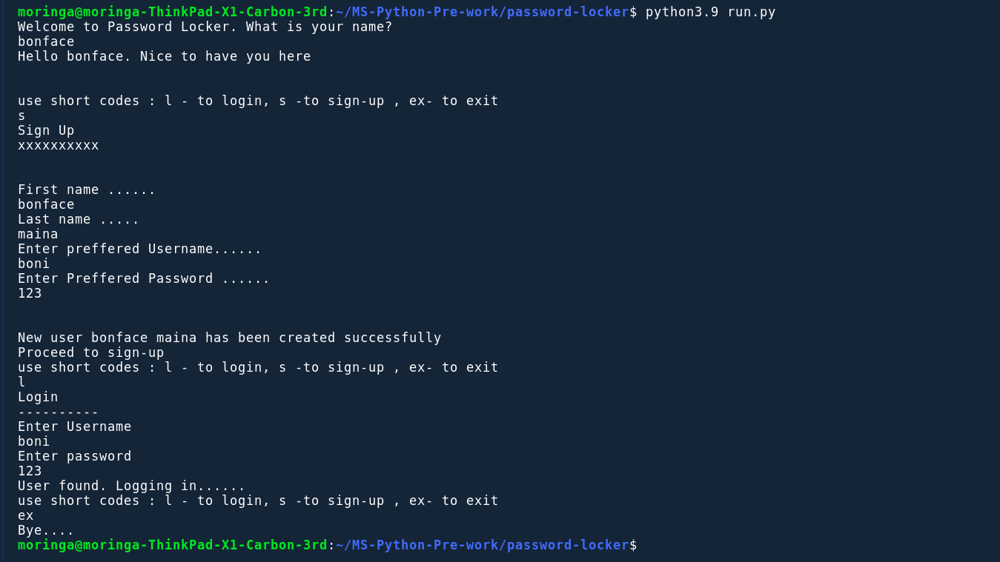

# Password Locker
## Description
This ia an app that helps one to manage the passwords accross the platforms and also helps generate more safer passwords 



## Installation requirements
You don't need to install anything you only need internet connection
Fork the repo and run the project on your terminal using:

```
python<version> run.py
```
## Technologies used
<ul>
   <li>HTML</li>
   <li>CSS</li>
   <li>jQUERY</li>
</ul>

## Development
  Want to contribute? Okay cool;follow the following steps:
<ul>
   <li>Fork the repo</li>
   <li>Create a new branch</li>
   <li>Make appropriate changes in the files</li>
   <li>Add changes to reflect the changes made</li>
   <li>Commit your changes</li>
   <li>Push to a Branch</li>
   <li>Create a Pull request</li>
</ul>


## license
[license](/LICENSE)
## Authors
@bonface221